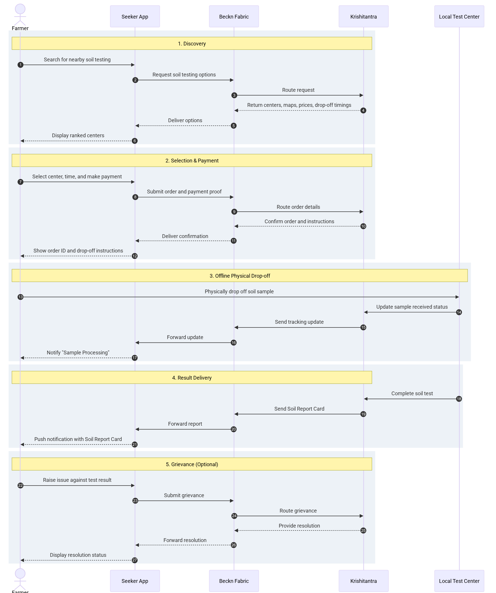

# Soil Health Testing Business Use Case — Template

## What this document is

This is a template for authoring an ONA business use case. It is the first of three layered artifacts ONA produces for any new service on the network:

| Layer | Primary author | Artifact |
|---|---|---|
| Business use case | Domain authors, collective members | This template, filled in — actors, narrative, interactions, crucial attributes, business rules, capability requirements |
| Implementation guide (IG) | Forward Deployment (Beckn-aware) | Protocol-level workflow: Beckn API mapping, contract lifecycle, payload shapes, error model |
| Schema pack | Architect / schema team | YAML / JSON-LD extensions, enumerations, discovery filters |

The business use case is the anchor — the IG and schema pack must trace back to it. But the three layers do not form a one-way pipeline: once the use case is stable, the IG and schema pack are written in parallel, each shaping the other, with corrections flowing back up to this document whenever the business meaning turns out to be unclear.

---

## What to keep in and what to keep out

The business use case is read by domain people, the ONA collective, and Beckn-aware teams who will translate it downstream. Write it so a domain reader who has never heard of Beckn can follow every sentence.

**Keep in this document:**

- Actors and their motivations
- The narrative of the interaction, in plain English
- Business rules, exceptions, capability requirements
- The crucial attributes the network must surface at each interaction (e.g., clinical validation at discovery, consent fields at engagement establishment)
- Open questions for the ONA collective to decide

**Keep out of this document (these belong in the IG or schema pack):**

- Beckn API verbs (discover, select, init, confirm, update, status)
- Context fields or flags (context.try, context.action, etc.)
- Schema container names, JSONPath expressions, YAML snippets
- Network setup narrative (NFO registration, catalog subscription, etc. — a business UC can assume the network is live)

> **Quick sentence test:** If a sentence names an API verb, a context field, a schema container or a payload shape, it belongs in the IG. If it names a capability the network must support without saying how, it belongs here.

---

## How to use the skeleton below

Keep all 11 section headings — they are the ONA collective's review checklist. Fill each with use-case-specific content. The Capability Requirements (§10) and Open Questions (§11) sections are where the collective makes its decisions; keep those especially honest.

A worked example of a filled-in template is `ONA_Swaasa_Business_Use_Case_v0.2` — the Swaasa AI cough analysis use case.

---

## Skeleton

### 1. Use case summary

A farmer needs to test their soil to understand its health and adjust crop nutrition. The farmer uses a seeker application to search for nearby soil testing centers. The initial phase leverages Beckn v2 discovery to return local Krishitantra test centers, complete with physical addresses, map locations, transparent test pricing, and available sample drop-off timings. The farmer selects a center, commits to the test and pays offline at the physical drop-off center, and physically drops off the soil sample. Once processed, Krishitantra pushes a structured Soil Report Card back to the farmer's application. A grievance mechanism ensures the farmer has recourse if results are delayed or disputed.

---

### 2. Why this matters on ONA

This use case exercises capabilities that bridge physical agriculture with digital workflows:

- **Location-Aware Discovery:** The network must accurately map physical farm locations to the nearest operable offline drop-off centers.
- **O2O (Online-to-Offline) State Tracking:** The transaction starts online, jumps to an offline physical drop-off, and resumes online. The network schema must track status across this boundary.
- **End-to-End Fulfillment:** Demonstrates the complete lifecycle required for government demos, holding the provider accountable for offline execution.
- **Digital Data Delivery:** Secure, structured return of a critical agricultural asset (the Soil Report Card) pushed directly to the seeker app.
- **Grievance Handling:** Ensures the farmer has an integrated voice if the physical test fails or the data is contested.

---

### 3. Actors

Two sub-sections.

**3.1 Actors**

| Actor | Role | Notes |
|---|---|---|
| Farmer (Seeker) | User of the application | The individual needs soil analysis to make farming decisions. |
| Seeker App | The interface | Connects the farmer to the Beckn Fabric. |
| Krishitantra (Provider) | Capacity provider | The corporate entity holding the soil-testing capabilities and integrations. |
| Local Test Center / Agent | Operational node | The physical location or human agent where the soil sample is dropped off and analyzed. |

**3.2 Network sides (for orientation only)**

The network features a seeker side (the farmer application) and a provider side (Krishitantra's digital backend). The schema must route requests across the Beckn Fabric from the seeker directly to the provider, tracking the lifecycle of the soil sample testing process.

---

### 4. Preconditions

- The farmer's facing app is integrated with the Beckn Fabric.
- Krishitantra centers are published on the network with accurate geolocation coordinates, open hours, and drop-off windows.

---

### 5. User journey

- Smita, a farmer wants to test the quality of her soil to plan agri inputs and choose the right crop for better yield.
- She uses a Beckn-enabled app integrated with the UKI Network to search for soil testing centres and receive detailed soil analysis.
- She searches for soil testing centres via the BAP app, supporting multilingual input.
- The app displays a list of soil testing service providers (BPPs) and allows Smita to filter results by:
  - Rating
  - Farm/sample collection location
  - Cost
  - Preferred date and time
  - Collection type:
    - Pick-up from farm (by provider)
    - Delivery to testing centre (by farmer)
  - Required test types:
    - Soil Tests:
      - NPK (Primary Nutrients)
      - Ca, Mg, S (Secondary Nutrients)
      - EC, pH, OC (Electrical Conductivity, pH, Organic Carbon)
      - Zn, B, Cu, Fe, Mo, Mn (Micronutrients)
      - Others: Soil Texture, Soil Moisture, Contaminants, CEC
      - All parameters
    - Water Test
    - Chemical Test
- Smita selects Krishi Kendra Soil Services as the provider.
- The provider responds with:
  - Available time slots
  - Service quote (based on collection type)
  - Pre-requisites for soil sample collection (format: video/image/audio/PDF)
  - Terms and conditions (cancellations, returns/refunds)
- Provider may optionally request crop-related details:
  - Current Crop Info: Category, Type, Crop, Variety
  - Previous Crop Info: Same as above
  - Previous Yield (optional)
- Smita accepts the service terms, selects Cash on Delivery as payment mode, and confirms the order.
- Provider confirms booking, shares Order ID, and details of agent and scheduled time.

#### Fulfilment Scenarios

1. **Farm Collection:**
   - Smita receives updates on the collection day.
   - Service provider visits the farm, collects the sample.
   - Smita pays in cash.

2. **Collection at Testing Centre:**
   - Smita collects and prepares soil as instructed.
   - She delivers the sample to the centre and pays in cash.

- Smita receives:
  - Ongoing status updates on testing.
  - A final report (PDF) and intervention recommendations (via video, PDF, or image).

#### Post-Fulfilment

- Smita rates the service provider on:
  - Product/service quality
  - Provider behavior (punctuality, politeness)
  - Support received
- The provider may request additional feedback.
- Smita can contact support services if needed.

---

A farmer decides they need a soil test to determine fertilizer requirements for the upcoming season. They open the seeker application and search for "soil testing." Based on their geolocation, the application queries the network. Krishitantra's systems respond, presenting the farmer with a list of active local centers, detailed map locations, the price of the test, and available time slots to physically drop off the soil sample.

The farmer compares the choices and selects the most convenient center. They confirm the test price and booking, and the farmer will pay offline at the center.

The application provides drop-off instructions. The farmer travels to the Krishitantra center and hands over the soil sample. The center operator logs the receipt in their system, triggering a status update on the farmer's app to "Sample Processing."

Once the analysis is finished, Krishitantra generates a detailed assessment and pushes the Soil Report Card back through the network. The farmer receives a notification and views the results in their app. If the report is incorrect or severely delayed, the farmer uses a 'Raise Issue' button which will display the test center's contact details so the user can reach out directly for resolution.

**Journey at a glance**

---

### 6. Key interactions (business level)

One sub-section per phase of the interaction. Typical phases: discovery, selection, engagement establishment, pre-commit / preview, commit, result delivery. Each sub-section has a three-column table (What the user does / What the network must do / What the user sees) followed by a bold line calling out the crucial attributes at that step.

#### 6.1 Discovery

| What the user does | What the network must do | What the user sees |
|---|---|---|
| Searches for soil testing near their location. | Execute Beckn v2 discover/on_discover scoped to the area. Filter out closed centers. | A list of nearby soil test centers. Addresses and map locations. Prices for the test. Sample drop-off timings. |

> **Crucial attributes at discovery time:** GPS coordinates, full physical address, real-time operating hours/drop-off slots, and test price.

#### 6.2 Selection & Engagement

| What the user does | What the network must do | What the user sees |
|---|---|---|
| Chooses a center and selects a drop-off time window. | Execute steps. Lock the price and reserve the drop-off time slot. | Confirmation of the center's details, the locked price, and a prompt indicating that payment will be collected offline at the test center. |

> **Crucial attributes at this step:** Locked drop-off window, final price.

#### 6.3 Commit and Drop off Booking

| What the user does | What the network must do | What the user sees |
|---|---|---|
| Books for the test. | Lock the order | A confirmed order receipt, an order ID, and instructions on how and where to drop the physical sample. |

> **Crucial attributes at this step:** Reference ID, Order ID, explicit instructions for packaging/dropping off the soil.

#### 6.4 Physical Drop-off & Status Tracking

| What the user does | What the network must do | What the user sees |
|---|---|---|
| Physically leaves the sample at the center. | The provider node sends an update indicating receipt of the physical asset. | Status changes to "Sample Received / In Processing." |

#### 6.5 Result Delivery

| What the user does | What the network must do | What the user sees |
|---|---|---|
| Waits for results. | Push the finalized data through an update when Krishitantra sends the soil report card back to the farmer via the application. | A push notification and a downloadable/viewable structured Soil Report Card. |

#### 6.6 Grievance & Dispute

| What the user does | What the network must do | What the user sees |
|---|---|---|
| Disputes the report. | Facilitate raising a grievance against the soil test result via Beckn's endpoints. | Form to submit the issue, along with the direct contact details of the respective test center for immediate resolution. |

---

### 7. Data and consent expectations

Three sub-sections.

**7.1 What must be protected**

What never travels on the network beyond references (identified details, raw inputs, derived inferences tied to identity). The farmer's exact farm coordinates, personal identifiable information, and the proprietary soil health data contained in the report card must not be used for unauthorized third-party training or marketing without explicit, separate consent.

**7.2 Consent as a first-class business concept**

Consent artifact fields: subject, purpose, scope, duration, mediator, revocation path. How long is it valid. Who retains it? The consent artifact must cover the physical testing of the soil and the digital transmission of the report. All data handling and consent architectures must be fully DEPA (Data Empowerment and Protection Architecture) compliant.

---

### 8. Exceptions and business rules

Bulleted list of realistic exceptions and the business rule that handles each: bad inputs, refused consent, provider outage, expired credentials, disputed results, connectivity loss, minors/guardians, critical referral paths.

- **Drop-off missed:** If the farmer fails to drop off the sample within the confirmed timing, the order should be re-schedulable or canceled based on Krishitantra's refund policy.
- **Sample rejected:** If the sample is too small or contaminated, the center must send an update rejecting the sample, and refund the offline payment if it was already collected.
- **Provider SLA breach:** If the report card is not delivered within the declared SLA, the grievance path must automatically offer a refund or an escalation.

---

### 9. Success criteria

Three-column table: Dimension | Indicator | Threshold. Name the dimensions (findability, informed choice, quality gating, delivery reliability, time to result, consent integrity, clinical appropriateness). Describe the indicator for each. Leave the threshold column as "Collective to set" — the actual numbers are a policy call for the ONA collective, not for this document.

| Dimension | Indicator | Threshold |
|---|---|---|
| Findability | Time from search to returning actionable on_discover data | Collective to set |
| Fulfillment | Share of paid tests where the soil sample was successfully dropped off | Collective to set |
| Digital Delivery | Share of tests where the Soil Report Card was successfully pushed without polling errors | Collective to set |
| Grievance Response | Turnaround time on issues raised against test results | Collective to set |

---

### 10. Capability requirements on the network

Bulleted list naming each capability the network must provide for this use case to be realisable, in business terms — not as Beckn features. This is the hand-off to the FD and architect teams. Typical capabilities: filtered discovery with standardised trust signals, pre-commit check pattern, structured consent artifact, off-transaction handling of raw PHI, standardised follow-up codes, push + polled delivery, grievance reference, audit trail of references without PHI content.

- **Robust Location Schema:** The network must correctly parse and return maps and drop-off points for offline routing.
- **File / Structured Data Payload:** The schema must support embedding a secure reference (like a signed URL or structured JSON) representing the Soil Report Card inside the Beckn fabric call.
- **Integrated Grievance Paths:** A standardized format for raising a dispute via the application that Krishitantra can programmatically ingest.

---

### 11. Open questions for the ONA collective

Bulleted list of decisions the collective needs to ratify before implementation can proceed. Business / policy questions only — retention windows, standardisation of follow-up codes, consent custody, clinical validation bar, delivery SLOs, FLW credential issuers, etc. Where the authoring team has a view, mark it as a recommendation, but leave the decision to the collective.

- **Report Format Standardization:** Does NFH require Krishitantra's Soil Report Card to follow a specific interoperable agricultural standard (e.g., specific JSON schemas for NPK values), or is a PDF/proprietary format sufficient for V2?
- **Physical Identification:** How does the test center physically identify that a dropped-off sample belongs to a specific digital Beckn order ID? *(Recommendation: Require the app to generate a shortcode or QR code for the farmer to attach to the sample bag.)*
- **Grievance Arbitration:** If a grievance against the soil test result cannot be resolved bilaterally between the farmer and Krishitantra, who acts as the network arbiter for the dispute?

---

### Appendices

**Appendix A — Glossary**

Only business terms used in this document. Beckn-specific terms (BAP, BPP, Resource, Offer, Contract, etc.) are defined in the IG companion, not here.

*(Add further appendices if the use case needs them — but keep the shared version lean. Implementation-facing cross-references belong in the IG, not in appendices to this document.)*
